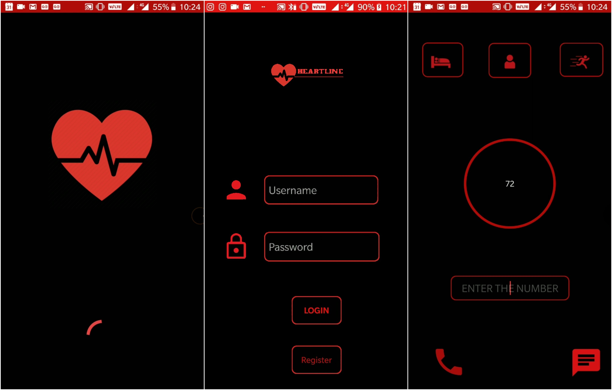

## What is the app?
This is an health monitoring system. It uses data from the pulse sensor to monitor a persons health and makes automated calls.It sends data from the pulse sensor to firebase real time data base using arduino(code in arduino file) and makes automated calls based on this data

## How it works?
* A pulse sensor is used to get the pulse from the user and is connected to a nodeMCU
* The data from nodeMCU is sent the **Firebase**. Get the code [here](https://github.com/maha2000/Arduino-codes/blob/master/pulse%20sensor%20to%20firebase%20code).
* The app is built using Android STudio. It gets the in live updates of pulse.
* Once the pulse reaches a certain threshold a call is made (Automatically as per code and manual demo is shown in image)

## Sample image

